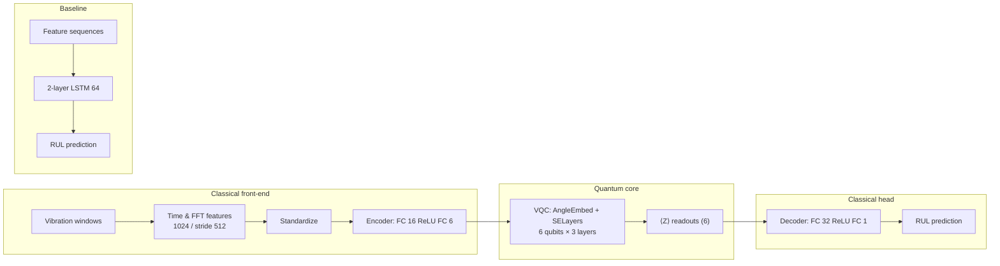

# Hybrid quantum–classical RUL prediction for rolling bearings


[](LICENSE)
[](https://github.com/LisanHub/hybrid-qml-rul-bearing/actions/workflows/ci.yml)
[](https://github.com/LisanHub)

Reproducibility code for the B.Sc. thesis **“Hybrid Quantum-Classical Regression Model for Remaining Useful-Life Prediction of Rolling Bearings”** (**Zadid Al Lisan**, Daffodil International University, supervised by **Dr. Md Alamgir Kabir**). The pipeline uses the **XJTU-SY** bearing data, a classical **LSTM** baseline and a **hybrid VQC + PyTorch** model, plus notebooks for EDA and publication-style comparisons.

---

## Abstract

Accurate **remaining useful life (RUL)** estimates for rolling element bearings reduce unplanned downtime and improve condition-based maintenance. This repository implements a **hybrid quantum-classical regressor** in which **windowed vibration features** feed a small **fully connected encoder**, a **PennyLane variational quantum circuit** (angle embedding, strongly entangling layers, Pauli-Z readouts), and a **classical decoder**, trained end-to-end alongside a **two-layer LSTM** baseline. Both heads predict **linearly normalized RUL** in **[0, 1]** from run-to-failure records. The workflow includes **depolarizing noise** on the quantum device for robustness studies.

---

## Architecture (conceptual)



**ASCII sketch**

```
Raw CSV (H/V acc) ──► preprocessing ──► sliding-window features ──┬──► scaler
                                                                    ├──► LSTM baseline ──► RUL
                                                                    └──► FC encoder ──► VQC ──► FC decoder ──► RUL
```

---

## Installation

**Requirements:** Python **3.10** (recommended), `git`, and enough disk/RAM to load XJTU-SY runs (~millions of samples per bearing).

```bash
python -m venv .venv
# Windows: .venv\Scripts\activate
# macOS/Linux: source .venv/bin/activate
pip install --upgrade pip
pip install -r requirements.txt
```

For **GPU-accelerated PyTorch**, reinstall `torch` from [pytorch.org](https://pytorch.org/get-started/locally/) for your CUDA build; the other pins are kept for reproducibility where possible.

### Dataset layout

Download the **XJTU-SY** bearing CSVs and place them so that **`Bearing1_1` … `Bearing1_5`** appear under your chosen root (nested folders such as `data/raw/XJTU-SY_Bearing_Datasets/35Hz12kN/` are fine). The loader searches for `Bearing1_1` under `--data_dir`.

**Train / test split (default):** `Bearing1_1`–`Bearing1_4` → train, `Bearing1_5` → test.

---

## End-to-end pipeline (`main.py`)

From the repository root, run:

```bash
python main.py --data_dir data/raw --mode all --epochs 50 --noise_level 0.0
```

| Flag | Description |
|------|-------------|
| `--data_dir` | Root that contains (or parents) `Bearing1_*` folders |
| `--mode` | `preprocess`, `train_classical`, `train_hybrid`, `evaluate`, or `all` |
| `--epochs` | Training epochs for both models (default **50**) |
| `--noise_level` | Depolarizing probability for hybrid **evaluation** (default **0.0**) |
| `--max_train_windows` | Optional subsample cap for quick dry runs |
| `--no_progress` | Disable `tqdm` training bars |

**Outputs (regenerated on each run):**

- `data/processed/`: feature pickles, scaler, manifest  
- `results/classical_lstm.pt`, `results/hybrid_model.pt`  
- `results/metrics.json` (merged metrics)  
- `results/figures/pipeline_classical_*.png`, `pipeline_hybrid_*.png`  
- `results/classical_predictions_*.npz`, `results/hybrid_predictions_*.npz`

**Approximate runtime (desktop CPU, full training windows, 50 epochs):** about **50–60 minutes** (feature extraction and hybrid steps dominate). Use `--max_train_windows` for faster experiments.

---

## Quickstart (clone → install → EDA)

```bash
git clone https://github.com/LisanHub/hybrid-qml-rul-bearing.git
cd hybrid-qml-rul-bearing
python -m pip install -r requirements.txt
python -m jupyter lab notebooks/01_eda.ipynb
```

**Author:** [Zadid Al Lisan](https://github.com/LisanHub) · **GitHub:** [LisanHub](https://github.com/LisanHub).

---

## Results (Bearing1_5, normalized RUL)

Reported after `python main.py --data_dir data/raw --mode all --epochs 50 --noise_level 0.0` on this codebase (see `results/metrics.json`). *Exact numbers may vary slightly with hardware and PyTorch/PennyLane builds.*

| Model | Test bearing | MAE ↓ | RMSE ↓ | Notes |
|--------|----------------|-------|--------|--------|
| Classical LSTM | Bearing1_5 | 0.2219 | 0.2892 | `train_classical` / `evaluate` |
| Hybrid QML | Bearing1_5 | 0.1986 | 0.2548 | `noise_level=0.0` |

For the four comparison figures (metrics table, RUL overlay, MAE/RMSE bars, hybrid noise panel), run all cells in `notebooks/05_results_comparison.ipynb` after `main.py` has produced `results/metrics.json` and the `*_predictions_Bearing1_5.npz` files, or regenerate the notebook source with `python scripts/build_05_notebook.py` and execute it.

**Figure inventory**

| File | Produced by | Notes |
|------|-------------|--------|
| `pipeline_classical_Bearing1_5.png` | `main.py` (`--mode` includes `evaluate`) | True vs predicted RUL (classical) |
| `pipeline_hybrid_Bearing1_5.png` | `main.py` | Degradation-style plot for hybrid |
| `table_metrics_comparison.png` | Notebook **05** | Needs `metrics.json` |
| `rul_overlay_Bearing1_5.png` | Notebook **05** | Needs both NPZ prediction files |
| `bar_mae_rmse_comparison.png` | Notebook **05** | Needs `metrics.json` |
| `hybrid_noise_robustness.png` | Notebook **05** | **Curve** needs several `evaluate` runs at different `--noise_level` values (e.g. 0, 0.02, …, 0.1); with only one point, the notebook still saves a figure but annotates that the sweep is incomplete |
| `vqc_diagram.png` | Optional | Call `save_vqc_diagram` in `src/quantum_circuit.py` if you want a circuit diagram in the repo |

So: the **pipeline figures** are fully determined by `main.py`; the **comparison suite** is correct when notebook **05** is run with real inputs; the **noise robustness** figure is only a multi-point “sweep” after you log more than one noise level in `metrics.json`.

---

## Repository structure

```
hybrid-qml-rul-bearing/
├── .github/workflows/ci.yml  # import + compile checks
├── data/
│   ├── raw/                    # XJTU-SY CSVs (gitignored except .gitkeep)
│   └── processed/             # Cached features, scalers (gitignored)
├── notebooks/
│   ├── 01_eda.ipynb
│   ├── 02_preprocessing.ipynb
│   ├── 03_classical_baseline.ipynb
│   ├── 04_hybrid_qml_model.ipynb
│   └── 05_results_comparison.ipynb
├── scripts/
│   └── build_05_notebook.py
├── src/
│   ├── preprocessing.py
│   ├── features.py
│   ├── classical_model.py
│   ├── quantum_circuit.py
│   └── hybrid_model.py
├── results/
│   ├── figures/               # Plots (gitignored; .gitkeep only)
│   └── metrics.json           # Example merged metrics (tracked)
├── main.py
├── requirements.txt
├── CITATION.cff
├── LICENSE
└── README.md
```

Large artifacts (`*.pt`, `*.pkl`, raw CSVs, most figures) are **gitignored**; run `main.py` to regenerate them locally.

---

## Citation

If you use this code or build on this thesis work, please cite it. GitHub surfaces [`CITATION.cff`](CITATION.cff) in the repository sidebar.

```bibtex
@misc{lisan2026hybridqmlrulbearing,
  title        = {Hybrid Quantum-Classical Regression for Remaining Useful Life Prediction of Rolling Bearings},
  author       = {Lisan, Zadid Al},
  year         = {2026},
  howpublished = {B.Sc.\ thesis, Daffodil International University, supervised by Dr.\ Md Alamgir Kabir},
  url          = {https://github.com/LisanHub/hybrid-qml-rul-bearing}
}
```

---

## Contact & acknowledgements

- **Dataset:** [XJTU-SY bearing datasets](https://biaowang.tech/xjtu-sy-bearing-datasets/) and related publications.  
- **Supervisor:** Dr. Md Alamgir Kabir (Daffodil International University).  
- **Contact:** [lisan15-5426@diu.edu.bd](mailto:lisan15-5426@diu.edu.bd) · GitHub [@LisanHub](https://github.com/LisanHub).  
- Thanks to the **PyTorch**, **PennyLane**, **NumPy**, **pandas**, and **scikit-learn** communities.
